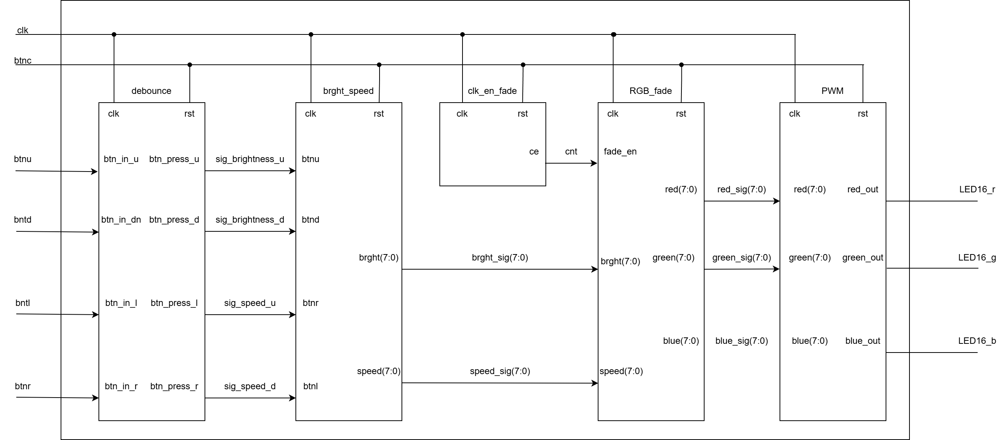
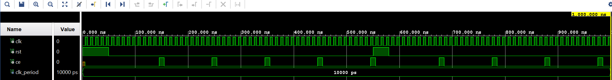
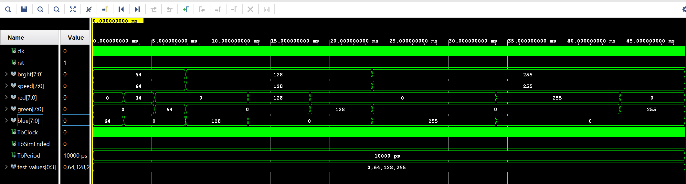
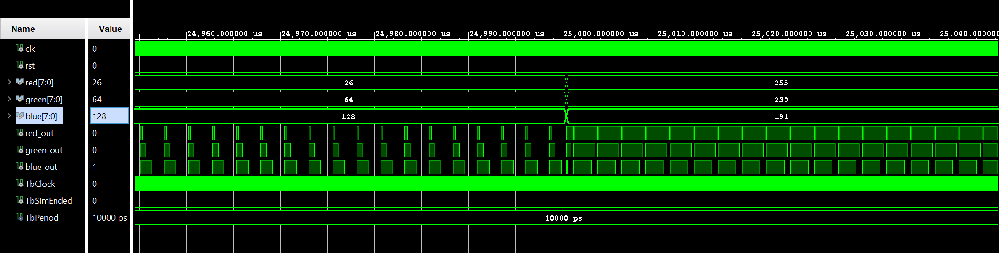

# RGB_MOOD_LAMP

RGB lampa s prechodom medzi RGB farbami s možnosťou zmeny rýchlosti prechodu farieb a intenzity jasu RGB led diódy pomocou tlačidiel dosky NEXYS A7-50T

<h3> Aktivita </h3>
<h4> 2. týždeň </h4> 
Samuel - brght_speed.vhd, brght_speed_tb.vhd, výpis do gitu
 
Jakub - RGB_fade.vhd, TOP_SCHEMA_RGB_LAMPA.png, výpis do gitu
 
<h4> 3. týždeň </h4>
Samuel - TOP_RGB_LAMPA.vhd, tb_PWM.vhd, výpis do gitu 
 
Jakub - tb_RGB_fade, PWM.vhd, výpis do gitu
 
<h4> 4. týždeň </h4>
debugging a úprava modulu clk_en_fade
 
<h4> 5. týždeň </h4>
implementácia a videonahrávka
 
<h1> Blokové schéma </h1>

<h1> Použité moduly </h1>

</head>
<body>
<table>
  <tr>
    <th>Modul</th>
    <th>Popis modulu</th>
  </tr>
  <tr>
    <td>Debounce</td>
    <td>Vyčistí signál z tlačidiel btnu, btnd, btnr a btnl od hazardov</td>
  </tr>
  <tr>
    <td>brght_speed</td>
    <td>Umožnuje nastavenie intenzity jasu RGB LED-ky a rýchlosti prechodu farieb na RGB LED-ke</td>
  </tr>
  <tr>
    <td>clk_en_fade</td>
    <td>Spomaľuje pôvodný clock FGPA-čka na clock o rýchlosti 1kHz</td>
  </tr> 
  <tr>
    <td>RGB_fade</td>
    <td>Vytvára prechod farieb RGB o nastavenej hodnote jasu a rýchlosti prechodu</td>
  </tr>
  <tr>
    <td>PWM</td>
    <td>Vysiela signál na rozsvietenie červenej, zelenej alebo modrej LED diódy RGB diódy</td>
  </tr>
</table>
</body>

<h1> Popis I/O portov modulu TOP </h1>

</head>
<body>
<table>
  <tr>
    <th>Signál</th>
    <th>I/O</th>
    <th>Popis</th>
  </tr>
  <tr>
    <td>clk</td>
    <td>in</td>
    <td>systémové hodiny</td>
  </tr>
  <tr>
    <td>btnc</td>
    <td>in</td>
    <td>reset</td>
  </tr>
  <tr>
    <td>btnu</td>
    <td>in</td>
    <td>singál na zvýšenie hodnoty jasu LED-ky</td>
  </tr>
  <tr>
    <td>btnd</td>
    <td>in</td>
    <td>singál na zníženie hodnoty jasu LED-ky</td>
  </tr>
  <tr>
    <td>btnr</td>
    <td>in</td>
    <td>singál na zvýšenie hodnoty rýchlosti prechodu farieb</td>
  </tr>
  <tr>
    <td>btnl</td>
    <td>in</td>
    <td>singál na zníženie rýchlosti prechodu farieb</td>
  </tr>
  <tr>
    <td>LED16_r</td>
    <td>out</td>
    <td>rozsvieti LED-ku na červeno</td>
  </tr>
  <tr>
    <td>LED16_g</td>
    <td>out</td>
    <td>rozsvieti LED-ku na zeleno</td>
  </tr>
  <tr>
    <td>LED16_b</td>
    <td>out</td>
    <td>rozsvieti LED-ku na modro</td>
  </tr>
</table>
</body>

<h1> Simulácie: </h1>

<h2> Sim brght_speed_tb.vhd </h2>
Simuluje zmeny intenzity jasu pre definované konštanty a zmenu rýchlosti prechodu farieb pre definované konštanty po stlační tlačidla

<table border="1">
  <tr>
    <th>brght</th>
    <th>popis</th>
    <th>speed</th>
    <th>popis</th>
  </tr>
  <tr>
    <th>0</th>
    <td>ledka nesvieti</td>
    <th>255</th>
    <td> najpomalší prechod farieb</td>
  </tr>
  <tr>
    <th>26</th>
    <td>ledka svieti na 10% zo svojho maximálneho jasu</td>
    <th>230</th>
    <td>prechod farieb je 10% rýchlosti z maxima</td>
  </tr>
  <tr>
    <th>64</th>
    <td>ledka svieti na 25% zo svojho maximálneho jasu</td>
    <th>191</th>
    <td>prechod farieb je 25% rýchlosti z maxima</td>
  </tr>
  <tr>
    <th>102</th>
    <td>ledka svieti na 40% zo svojho maximálneho jasu</td>
    <th>128</th>
    <td>prechod farieb je 40% rýchlosti z maxima</td>
  </tr>
  <tr>
    <th>128</th>
    <td>ledka svieti na 50% zo svojho maximálneho jasu</td>
    <th>102</th>
    <td>prechod farieb je 50% rýchlosti z maxima</td>
  </tr>
  <tr>
    <th>191</th>
    <td>ledka svieti na 75% zo svojho maximálneho jasu</td>
    <th>64</th>
    <td>prechod farieb je 75% rýchlosti z maxima</td>
  </tr>
  <tr>
    <th>230</th>
    <td>ledka svieti na 90% zo svojho maximálneho jasu</td>
    <th>26</th>
    <td>prechod farieb je 90% rýchlosti z maxima</td>
  </tr>
  <tr>
    <th>255</th>
    <td>ledka svieti maximálnou intenzitou</td>
    <th>0</th>
    <td>prechod farieb je najrýchlejší možný</td>
  </tr>
</table>
odkaz na testbench simulácie: <a href="projekt/sources/sim_sources/brght_speed_tb.vhd">brhgt_speed_tb.vhd</a>  
odkaz na source <a href="projekt/sources/new/brght_speed.vhd">brght_speed.vhd</a>

<h2> Sim tb_clk_en_fade </h2>
Simuluje spomalenie pôvodného clock signálu FPGA-čka

odkaz na testbench simulácie: <a href="projekt/sources/sim_sources/clk_en_fade_tb.vhd">tb_clk_en_fade.vhd</a>  
odkaz na source <a href="projekt/sources/new/clk_en_fade.vhd">clk_en_fade.vhd</a>

<h2> Sim tb_RGB_fade.vhd </h2>
Simuluje vytvorenie prechodu farieb RGB pre konkrétne nastavenú hodnotu jasu a rýchlosti prechodu farieb

odkaz na testbench simulácie: <a href="projekt/sources/sim_sources/tb_RGB_fade.vhd">tb_RGB_fade.vhd</a>  
odkaz na source <a href="projekt/sources/new/RGB_fade.vhd">RGB_fade.vhd</a>

<h2> Sim tb_PWM.vhd </h2>
Simuluj tvorbu šírkovo modulačných pulzov podľa nastavených hodnôt jasu 

<table>
<body>
  <tr>
    <th> brght </th>
    <th> strieda </th>
  </tr>
  <tr>
    <td> 26 </td>
    <td> 10% </td>
  </tr>
  <tr>
    <td> 64 </td>
    <td> 25% </td>
  </tr>
  <tr>
    <td> 128 </td>
    <td> 50% </td>
  </tr>
  <tr>
    <td> 191 </td>
    <td> 75% </td>
  </tr>
  <tr>
    <td> 230 </td>
    <td> 90% </td>
  </tr>
  <tr>
    <td> 255 </td>
    <td> 100% </td>
  </tr>
</body>
</table>  
odkaz na testbench simulácie: <a href="projekt/sources/sim_sources/tb_PWM.vhd">tb_PWM.vhd</a>  
odkaz na source <a href="projekt/sources/new/PWM.vhd">PWM.vhd</a>

<video width="320" height="240" controls>
  <source src="VID_202606506_154052861 (1).mp4" type="video/mp4">
</video>

<h4> Video </h4>
<video src="https://github.com" controls width="100%"></video>

<h4>Odkazy a použité nástroje</h4>
Xilinx Vivado 2025.2  
VHDL  
AI - ChatGPT, Gemini.   
Constrain file je z <a href="https://github.com/Digilent/digilent-xdc/blob/master/Nexys-A7-50T-Master.xdc">githubu</a> 
