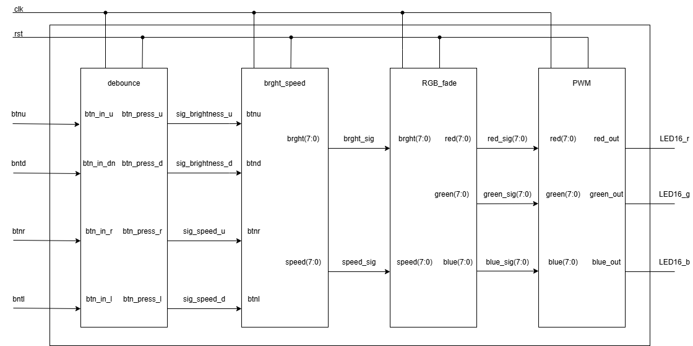
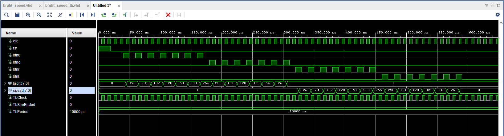
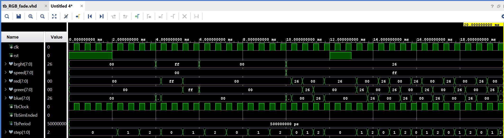
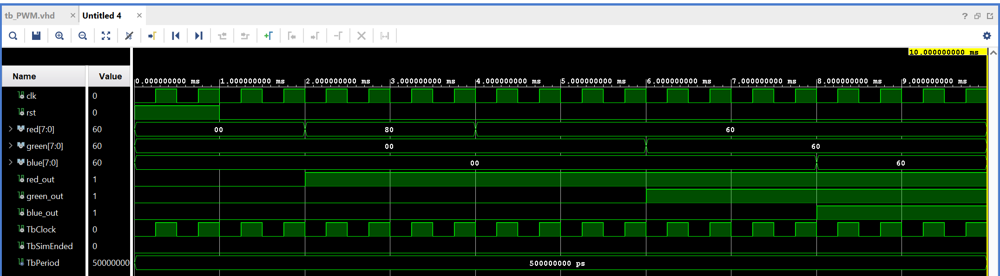

# RGB_MOOD_LAMP

RGB lampa s plynulým prechodom medzi RGB farbami s možnosťou zmeny rýchlosti a intenzity jasu RGB led diódy pomocou tlačidiel dosky NEXYS A7-50T

<h3> Aktivita </h3>
<h4> 2. týždeň </h4> 
Samuel - brght_speed.vhd, brght_speed_tb.vhd, výpis do gitu
 
Jakub - RGB_fade.vhd, TOP_SCHEMA_RGB_LAMPA.png, výpis do gitu
 
<h4> 3. týždeň </h4>
Samuel - TOP_RGB_LAMPA.vhd, tb_PWM.vhd, výpis do gitu 
 
Jakub - tb_RGB_fade, PWM.vhd, výpis do gitu
 

<h1> Blokové schéma </h1>

<h1> Použité moduly </h1>

</head>
<body>
<table>
  <tr>
    <th>Modul</th>
    <th>Popis modulu</th>
  </tr>
  <tr>
    <td>Debounce</td>
    <td>Vyčistí signál z tlačiidiel btnu, btnd, btnr a btnl od hazardov</td>
  </tr>
  <tr>
    <td>brght_speed</td>
    <td>Umožnuje nastavenie intenzity jasu RGB LED-ky a rýchlosti prechodu farieb na RGB LED-ke</td>
  </tr>
  <tr>
    <td>RGB_fade</td>
    <td>Vytvára prechod farieb RGB o nastavenej hodnote jasu a rýchlosti prechodu</td>
  </tr>
  <tr>
    <td>PWM</td>
    <td>Vysiela signál na rozsvietenie červenej, zelenej alebo modrej LED diódy RGB diódy</td>
  </tr>
</table>
</body>

<h1> Popis I/O portov modulu TOP </h1>

</head>
<body>
<table>
  <tr>
    <th>Signál</th>
    <th>I/O</th>
    <th>Popis</th>
  </tr>
  <tr>
    <td>clk</td>
    <td>in</td>
    <td>systémové hodiny</td>
  </tr>
  <tr>
    <td>rst</td>
    <td>in</td>
    <td>reset</td>
  </tr>
  <tr>
    <td>btnu</td>
    <td>in</td>
    <td>singál na zvýšenie hodnoty jasu LED-ky</td>
  </tr>
  <tr>
    <td>btnd</td>
    <td>in</td>
    <td>singál na zníženie hodnoty jasu LED-ky</td>
  </tr>
  <tr>
    <td>btnr</td>
    <td>in</td>
    <td>singál na zvýšenie hodnoty rýchlosti prechodu farieb</td>
  </tr>
  <tr>
    <td>btnl</td>
    <td>in</td>
    <td>singál na zníženie rýchlosti prechodu farieb</td>
  </tr>
  <tr>
    <td>LED16_r</td>
    <td>out</td>
    <td>rozsvieti LED-ku na červeno</td>
  </tr>
  <tr>
    <td>LED16_g</td>
    <td>out</td>
    <td>rozsvieti LED-ku na zeleno</td>
  </tr>
  <tr>
    <td>LED16_b</td>
    <td>out</td>
    <td>rozsvieti LED-ku na modro</td>
  </tr>
</table>
</body>

<h1> Simulácie: </h1>

<h2> Sim brght_speed_tb.vhd </h2>
Simuluje zmeny intenzity jasu pre definované konštanty a zmenu rýchlosti prechodu farieb pre definované konštanty po stlační tlačidla

<b>0</b> => 0% => ledka nesvieti  
<b>26</b> => ledka svieti na 10% zo svojho maximálneho jasu, prechod farieb je 10% rýchlosti z maxima  
<b>64</b> => ledka svieti na 25% zo svojho maximálneho jasu, prechod farieb je 25% rýchlosti z maxima  
<b>102</b> => ledka svieti na 40% zo svojho maximálneho jasu, prechod farieb je 40% rýchlosti z maxima  
<b>128</b> => ledka svieti na 50% zo svojho maximálneho jasu, prechod farieb je 50% rýchlosti z maxima  
<b>191</b> => ledka svieti na 75% zo svojho maximálneho jasu, prechod farieb je 75% rýchlosti z maxima  
<b>230</b> => ledka svieti na 90% zo svojho maximálneho jasu, prechod farieb je 90% rýchlosti z maxima  
<b>255</b> => ledka svieti maximálnou intenzitou, prechod farieb je najrýchlejší možný  
 
odkaz na testbench simulácie: <a href="projekt/sources/sim_sources/brght_speed_tb.vhd">brhgt_speed_tb.vhd</a>

<h2> Sim tb_RGB_fade.vhd </h2>
Simuluje vytvorenie prechodu farieb RGB pre konkrétne nastavenú hodnotu jasu a rýchlosti prechodu farieb

odkaz na testbench simulácie: <a href="projekt/sources/sim_sources/tb_RGB_fade.vhd">tb_RGB_fade.vhd</a>

<h2> Sim tb_PWM.vhd </h2>
Simuluje postupné rozsvecovanie červenej, zelenej a modrej LED-ky RGB LED diódy

odkaz na testbench simulácie: <a href="projekt/sources/sim_sources/tb_PWM.vhd">tb_PWM.vhd</a>
