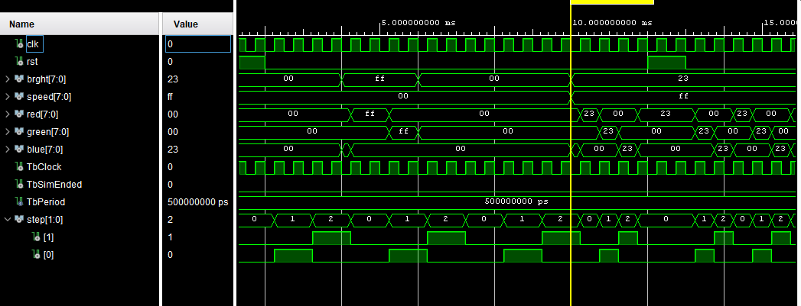

# RGB_MOOD_LAMP

rgb lampa preblikávajúca medzi RGB farbami a ich odtienami s možnosťou zmeny rýchlosti a intenzity jasu RGB led diódy pomocou tlačidiel dosky NEXYS A7-50T

Aktivita:
2. týždeň:  
Samuel - brght_speed.vhdl,brght_speed_tb.vhdl, vypis do gitu 
 
Jakub - RGB_fade.vhd, Schema_finale.png, vypis do gitu 
3. týždeň:  

<h1 style="color: #4CAF50;"> Popis I/O portov </h1>

</head>
<body>
<table>
  <tr>
    <th>Signál</th>
    <th>I/O</th>
    <th>Popis</th>
  </tr>
  <tr>
    <td>btnu</td>
    <td>vstup</td>
    <td>zvýšenie hodnoty jasu LED-ky</td>
  </tr>
  <tr>
    <td>btnd</td>
    <td>vstup</td>
    <td>zníženie hodnoty jasu LED-ky</td>
  </tr>
  <tr>
    <td>btnr</td>
    <td>vstup</td>
    <td>zvýšenie hodnoty rýchlosti prechodu farieb</td>
  </tr>
  <tr>
    <td>btnl</td>
    <td>vstup</td>
    <td>zníženie rýchlosti prechodu farieb</td>
  </tr>
  <tr>
    <td>LED16_r</td>
    <td>výstup</td>
    <td>rozsvieti LED-ku na červeno</td>
  </tr>
  <tr>
    <td>LED16_g</td>
    <td>výstup</td>
    <td>rozsvieti LED-ku na zeleno</td>
  </tr>
  <tr>
   <td>LED16_b</td>
   <td>výstup</td>
   <td>rozsvieti LED-ku na modro</td>
  </tr>
</table>
</body>
 
<h1 style="color: #4CAF50;"> Simulácie: </h1>

<h2> Sim brght_speed_tb.vhdl </h2>
Simuluje zmeny intenzity jasu pre definované konštanty a zmenu rýchlosti prechodu farieb pre definované konštanty 

  
 
RGB_fade.vhdl slúži k vytvoreniu postupného prechodu farieb RGB 

